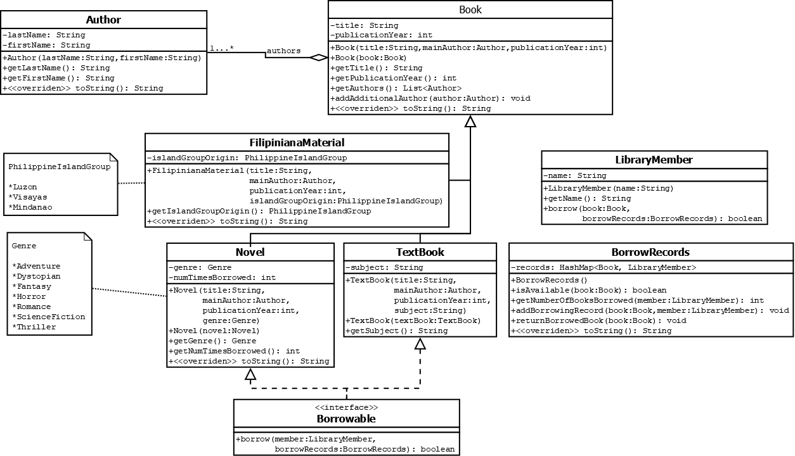

# Library

This GitHub repository contains a Java project that simulates a library system. The project includes various classes, such as `Novel`, `Book`, `LibraryMember`, `Author`, `BorrowRecords`, `FilipinianaMaterial`, `PhilippineIslandGroup`, `Genre`, and `Textbook`, each representing different entities and functionalities of the library system.

## Problem Statement

The problem was created by Sir Jomari Joseph Barera, an instructor at Visayas State University. The objective is to implement a library system with specific constraints and requirements.

- A `Novel` is a type of book that can be borrowed only 10 times. It can only be borrowed if it is available based on the `BorrowRecords`.

- A `LibraryMember` can borrow a maximum of 3 different books. When a `LibraryMember` successfully borrows a book, the `BorrowRecords` should be updated by adding a borrowing record.

## UML Diagram

The UML diagram provided in the repository illustrates the relationships between different classes and their attributes and methods.



## Class Implementations

The following classes have been implemented based on the provided UML diagram:

## Novel Class

The `Novel` class represents a novel book and includes the following features:

- The attributes of the class are declared according to the UML diagram.

- The constructor initializes the `title`, `mainAuthor`, and `publicationYear` attributes using the constructor of the superclass. The `genre` attribute is initialized with the corresponding parameter, and `numTimesBorrowed` is set to 0.

- The copy constructor calls the copy constructor of the superclass and assigns the `genre` attribute with the value from the parameter, while `numTimesBorrowed` is set to 0.

- The accessors are implemented as specified in the UML diagram.

- The `borrow` method is overridden to apply the necessary procedures. If the borrow transaction is successful, it returns `true`; otherwise, it returns `false`. The necessary attributes are updated based on the specification. The `toString` method is overridden using the provided code snippet.

```java
@Override
public String toString() {
    return "[N:" + this.numTimesBorrowed + "] " + super.toString();
}
```

## Book Abstract Class

The `Book` abstract class represents a book and includes the following features:

- The attributes of the abstract class are declared according to the UML diagram.

- The constructor initializes the `authors` collection by appending the `mainAuthor` parameter object as its first author. The `title` and `publicationYear` attributes are then initialized using the corresponding parameters.

- The copy constructor initializes the `title` and `publicationYear` attributes based on the equivalent attributes from the parameter object. For the `authors` attribute, the object collection is copied from the parameter object.

- The accessors are implemented as specified in the UML diagram. The `getAuthors` method returns a copy of the object held by the `authors` attribute. The `addAdditionalAuthor` method adds the parameter as an element of the `authors` attribute (object collection).

- The `toString` method is overridden using the provided code snippet.

```java
@Override
public String toString() {
    String text = this.title + "(" + this.publicationYear + ") by ";
    for (Author a : this.authors) {
        text += a;
        if (!a.equals(this.authors.get(this.authors.size() - 1)))
            text += ", ";
    }
    return text + " ";
}
```

## LibraryMember Class

The `LibraryMember` class represents a library member and includes the following features:

- The attributes of the class are declared according to the UML diagram.

- The constructor initializes the attributes based on the given parameter.

- The accessors are implemented as specified in the UML diagram.

- The `borrow` method is implemented based on the specifications provided. If a borrow transaction succeeds, it returns `true`; otherwise, it returns `false`.

The remaining classes (`Author`, `BorrowRecords`, `FilipinianaMaterial`, `PhilippineIslandGroup`, `Genre`, and `Textbook`) were implemented based on the UML diagram.

## Contribution

Contributions to this repository are welcome. If you would like to contribute, please follow these steps:

1. Fork the repository by clicking on the "Fork" button on the repository's page.

2. Clone your forked repository to your local machine:

   ```
   git clone https://github.com/your-username/name-of-repo.git
   ```

3. Create a new branch for your changes:

   ```
   git checkout -b feature/new-feature
   ```

4. Make your desired changes and commit them:

   ```
   git commit -m "Add new feature"
   ```

5. Push your changes to your forked repository:

   ```
   git push origin feature/new-feature
   ```

6. Open a pull request on the original repository's page and describe your changes.

Once your pull request is reviewed and approved, it will be merged into the main repository. Thank you for your contribution!

## Acknowledgment

This project was created as a mock laboratory exam for Java OOP, covering concepts of inheritance and polymorphism. The problem and specifications were provided by Sir Jomari Joseph Barera, an instructor at Visayas State University.
